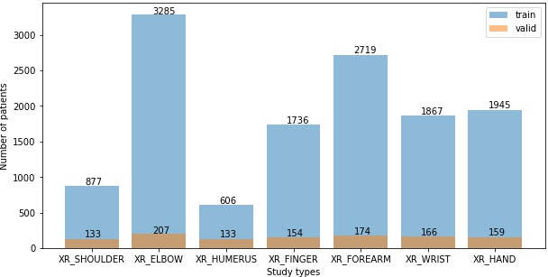
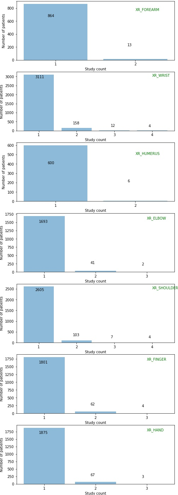
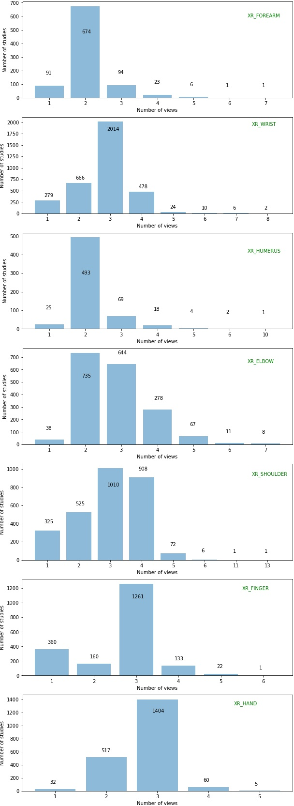

# Data Analysis Report for MURA

MURA is a dataset of musculoskeletal radiographs consisting of 14,982 `studies` from 12,251 `patients`, with a total of 40,895 `multi-view radiographic images`. Each `study` belongs to one of seven standard upper extremity radiographic `study
types`: elbow, finger, forearm, hand, humerus, shoulder and wrist. 

## Components of MURA dataset

MURA dataset comes with `train`, `valid` and `test` folders containing corresponding datasets, `train.csv` and `valid.csv` contain paths of `radiographic images` and their labels. Each image is labeled as 1 (abnormal) or 0 (normal) based on whether its corresponding study is negative or positive, respectively  

Sometimes, these radiographic images are also referred as `views`.

## Components of `train` and `valid` set

* `train` set consists of seven `study types` namely:

    `XR_ELBOW`  `XR_FINGER`  `XR_FOREARM`  `XR_HAND`  `XR_HUMERUS`  `XR_SHOULDER`  `XR_WRIST`

* Each `study type` contains several folders named like:

    `patient12104`  `patient12110`  `patient12116`  `patient12122`	`patient12128` ... 

* These folders are named after patient ids, each of these folders contain one or more `study`, named like:

    `study1_negative` `study2_negative` `study3_positive` ...  

* Each of these `study`s contains one or more radiographs (views or images), named like:

    `image1.png`  `image2.png` ...

* Each view (image) is RGB with pixel range [0, 255] and varies in dimensions.

**NOTE**: all above points are true for `test` set, except the third point, the `study` folder are named like: `study1`    `study2` ..

## Some insightful plots

### Plot of number of Patients vs `study type`

</img>

In `train` set `XR_WRIST` has maximum number of patients, followed by `XR_FINGER`, `XR_HUMERUS`, `XR_SHOULDER`, `XR_HAND`, `XR_ELBOW` and `XR_FOREARM`. `X_FOREARM` with 606 patients has got the least number. Similar pattern can be seen in  `valid` set, XR_WRIST has the maximum, followed by `XR_FINGER`, `XR_SHOULDER`,`XR_HUMEROUS`, `XR_HAND`,`XR_ELBOW`, `XR_FOREARM`.

### Plot of number of patients vs study count

Patients of a `study type` might have multiple `study`s, like a patient may have 3 `study`s for wrist, independent of each other.   
The following plot shows variation of number of patients with number of `study`s

**NOTE** study count = number of studies, so if 4 patients have study count 3, that means 4 patients have undergone 3 `study`s for a given `study type`

</img>

Patients of `XR_FOREARM` and `XR_HUMEROUS` `study type`s have either 1 `study` or 2 only.
Patients of `XR_FINGER`, `XR_HAND` and `XR_ELBOW` have upto 3 `study`s.
Patients of `XR_SHOULDER` and `XR_WRIST` have upto 4 `study`s

### Plot of number of `study`s vs number of views

Each `study` may have one or more number of views, the following plot variation of number of views per study in train dataset

</img>

Maximum number of views per study can be found in `XR_SHOULDER`, there is a study in it which has as many as 13 images (views), similarlyy `XR_HUMEROUS` has a study with 10 images. It can be seen that most of the `study`s have either 2, 3 or 4 images.
